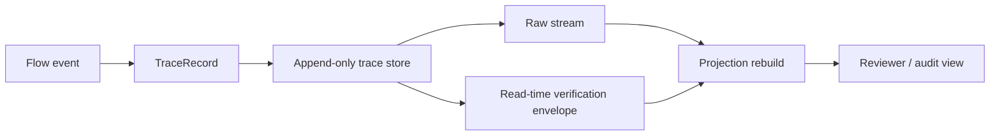

# Grant Evidence Package

Status: reviewer-facing evidence package.

Scope: this document summarizes the current TTM DB artifact, reproducible reviewer path, evidence assets, explicit non-claims, and near-term roadmap for grant reviewers and technical evaluators.

## One-sentence claim

TTM DB is an append-only ground-truth trace substrate for preserving irreversible transitions over time while keeping projections, analysis, and verification metadata outside the immutable trace boundary.

## Core idea

TTM DB separates raw history from interpretation.

```text
flow event -> trace record -> append-only store -> read-time verification envelope -> derived projection
```

The trace record is the ground truth. A projection, report, index, or verification envelope is a derived view.

## Why this matters

Agentic and adaptive systems need to answer questions that ordinary latest-state storage cannot answer well:

- What transition happened?
- Which thread of continuity did it belong to?
- What state reference changed?
- Why was the transition admissible?
- Which lane/context did it occur in?
- Can the stored seal be verified at read time?
- Can downstream projections be rebuilt without changing the trace?

TTM DB exists to preserve these transition records without mutating them after the fact.

## Reviewer path

Rust validation path:

```bash
cd rust
cargo test
```

Elixir validation path:

```bash
cd elixir
mix test
```

Repository-level inspection:

```text
README.md
docs/STREAM_ENVELOPES.md
rust/src/lib.rs
elixir/lib/ttm/trace.ex
```

## Architecture at a glance



The key rule is that verification and projections do not rewrite the underlying trace.

## Current evidence matrix

| Evidence asset | Reviewer question | Path / command | Current status |
| --- | --- | --- | --- |
| README positioning | Is the trace/projection boundary explained? | `README.md` | Documented |
| Stream envelope spec | Is read-time verification metadata specified? | `docs/STREAM_ENVELOPES.md` | Documented |
| Rust core | Is a TraceRecord / TraceEnvelope shape present? | `rust/src/lib.rs` | Implemented scaffold |
| Rust tests | Can Rust behavior be validated? | `cd rust && cargo test` | Implemented path |
| Elixir trace API | Is an append/stream/envelope API present? | `elixir/lib/ttm/trace.ex` | Implemented scaffold |
| Elixir tests | Can stream envelope behavior be validated? | `cd elixir && mix test` | Implemented path |
| Verification boundary | Is verification metadata kept outside records? | tests + `docs/STREAM_ENVELOPES.md` | Implemented / documented |

## What is already implemented

- Trace record shape for transition continuity.
- Append/stream API direction.
- Query/filter surface for trace streaming.
- Projection/rebuild direction in Rust scaffolding.
- Verification status model: verified, unverified, failed, unknown.
- TraceEnvelope concept in Rust and Elixir.
- Read-time envelope streaming in Elixir.
- Tests that verification metadata does not mutate stored records.
- Stream envelope specification.

## What TTM DB makes inspectable

TTM DB is designed to make transition history inspectable, including:

- which transitions occurred,
- which thread a transition belongs to,
- what state references changed,
- what admissibility rationale was recorded,
- what confidence was attached,
- which lane/context the transition belongs to,
- whether a seal can be verified at read time,
- whether projections can be rebuilt from raw traces.

## Relationship to T-Trace and verification

TTM DB should not invent cryptographic semantics.

It may store seals and call a configured integrity adapter, but verification status is derived at read time. The stored trace remains unchanged.

```text
stored trace record + configured verifier -> read-time envelope
```

This preserves a clean boundary:

- T-Trace / integrity adapter defines seal verification semantics.
- TTM DB stores trace records and exposes derived envelopes.
- Downstream tools build projections and reports.

## Relationship to the Liminal Evidence Stack

TTM DB is the lowest-level trace substrate candidate in the stack.

- **TTM DB:** immutable ground-truth transition trace.
- **LiminalDB:** reactive/adaptive storage, timelines, snapshots, and projections.
- **DRP:** decision records and supersession graph.
- **LTP:** deterministic trace replay and admissibility inspection.
- **CML:** causal-validity and responsibility-lineage audit.
- **PythiaLabs:** pre-execution gate for proposed high-risk agent actions.
- **LiminalQA:** applied QA decision intelligence.
- **DAO_lim:** AI infrastructure routing / gateway layer.

Short version:

```text
TTM DB preserves the irreversible trace.
Other layers interpret, replay, audit, gate, route, or project from it.
```

## What this project does not claim yet

TTM DB currently does not claim:

- production database maturity,
- distributed consensus,
- high-performance query engine status,
- replacement of Postgres, Kafka, event stores, or observability systems,
- cryptographic correctness by itself,
- production compliance guarantees,
- automatic semantic truth validation,
- complete agent memory solution,
- stable pre-1.0 API guarantees.

The current value is narrower: a small open-source substrate for preserving append-only transition traces and keeping read-time verification metadata outside the raw record.

## Why this is grant-relevant

Deterministic oversight requires reproducible evidence. If the underlying trace can be silently rewritten or mixed with later interpretation, replay and audit lose credibility.

TTM DB contributes one infrastructure primitive:

```text
append-only transition trace -> immutable ground truth -> derived envelopes/projections without mutation
```

This supports research into replay fidelity, trace-based evaluation, causal memory, and agentic oversight.

## Research / build roadmap

Near-term work can focus on:

1. **Trace schema hardening** — stabilize TraceRecord fields and invariants.
2. **Storage backend** — define durable append-only storage beyond in-memory scaffolding.
3. **Projection contracts** — specify how derived views rebuild from raw traces without mutation.
4. **Integrity adapter boundary** — formalize how T-Trace verification plugs into read-time envelopes.
5. **Conformance tests** — create fixtures for append order, query filters, verification states, and projection rebuilds.
6. **Cross-stack adapters** — integrate with LTP traces, CML findings, DRP decisions, and PythiaLabs gate outputs.
7. **Reviewer reports** — generate simple reports from raw trace + envelope + projection.

## Suggested reviewer checklist

A reviewer can ask:

- Is raw trace storage separated from derived interpretation?
- Does verification metadata avoid mutating stored records?
- Can tests validate envelope behavior?
- Are non-claims explicit?
- Is the role distinct from LiminalDB and LTP?
- Is there a credible path toward durable append-only trace storage?

## Current strongest positioning

Use this formulation in applications:

```text
TTM DB is an append-only ground-truth trace substrate for agentic and adaptive systems. It preserves irreversible transitions over time while keeping projections, reports, and verification metadata outside the immutable trace boundary.
```

## Short version

```text
TTM DB stores what happened.
It does not rewrite history to explain it.
```
